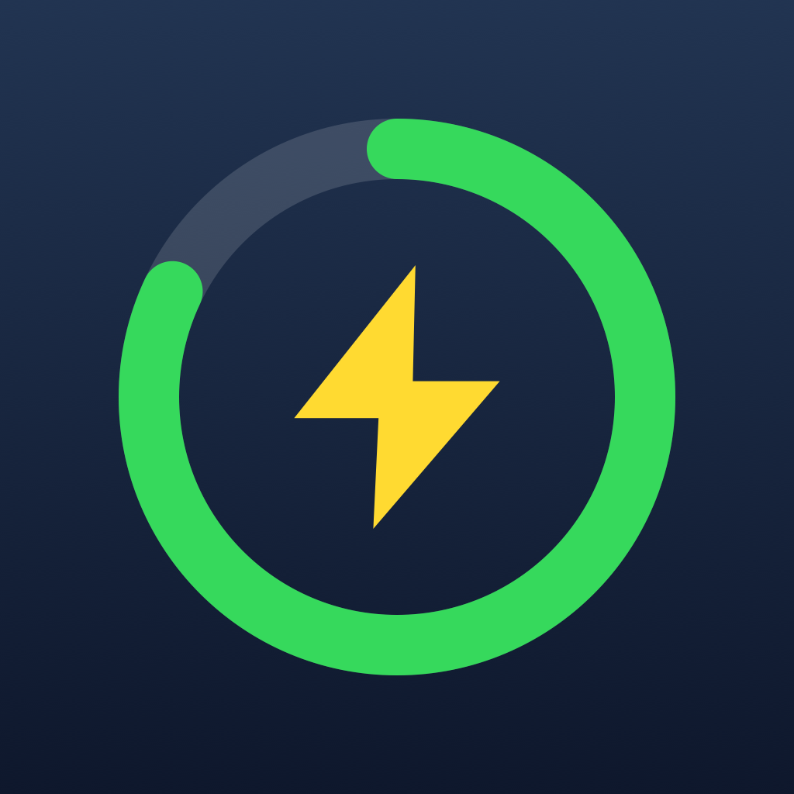
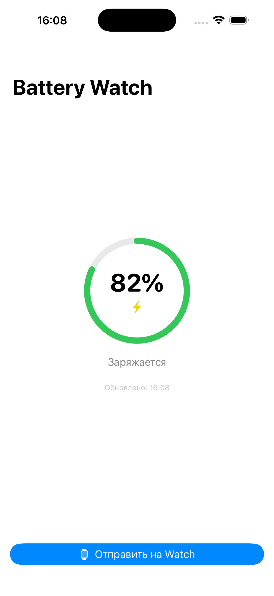
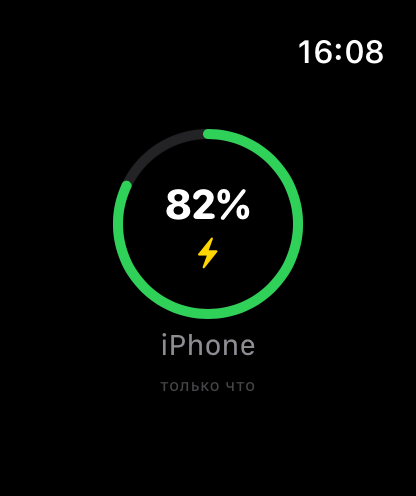
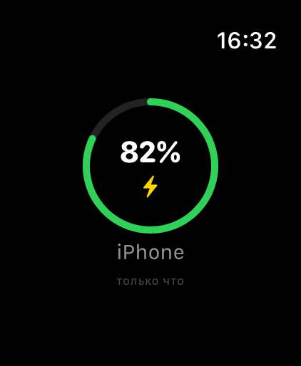

<p align="center">
  
</p>

<h1 align="center">Battery Watch</h1>

<p align="center">
  See your iPhone's battery level right on your Apple Watch — in the app and as a watch face complication.
</p>

---

## What it does

Battery Watch is a two-part app: an iOS app monitors the iPhone's battery and pushes the level to the paired Apple Watch over WatchConnectivity. The watch app shows the current percentage with a charging indicator, and a WidgetKit extension provides complications for the watch face in four families (circular, corner, rectangular, inline).

| iPhone app | Watch app | On Apple Watch Ultra |
|:---:|:---:|:---:|
|  |  |  |

## How updates flow

| Scenario | Mechanism | Latency |
|---|---|---|
| Either app is open | `WCSession.sendMessage` | instant |
| Watch app wakes up | `updateApplicationContext` (always queued) | on wake |
| Complication on an active face | `transferCurrentComplicationUserInfo` | ~50 pushes/day (≈ every 30 min) |
| Nothing else fires | WidgetKit timeline fallback | every 15 min (re-reads cached value) |

The watch app also pings the iPhone on launch (`scenePhase == .active`), which wakes the iOS app in the background and gets a fresh reading.

Data is shared between the watch app and the widget extension through an App Group (`UserDefaults(suiteName:)`).

## Requirements

| | Minimum |
|---|---|
| iOS | 17.0 |
| watchOS | 10.0 |
| Xcode | 16+ (developed with Xcode 26.5) |
| Tested on | iPhone Air + Apple Watch Ultra 3, iOS/watchOS 26.5 |

## Project structure

```
Shared/    BatteryData.swift            — model + App Group storage (all 3 targets)
iPhone/    BatteryWatchApp, ContentView, PhoneBatteryMonitor (UIDevice + WCSession)
Watch/     BatteryWatchWatchApp, ContentView, WatchConnectivityManager
Widget/    BatteryWidget.swift          — 4 complication families
project.yml — XcodeGen spec (the .xcodeproj is generated, not committed)
```

## Building

```bash
brew install xcodegen
xcodegen generate
open BatteryWatch.xcodeproj
```

Set your Team in **Signing & Capabilities** for all three targets (a free Personal Team works — apps expire after 7 days), make sure the App Group ID matches yours in `BatteryData.swift` and `project.yml`, then run the `BatteryWatch` scheme on your iPhone and the `BatteryWatchWatch` scheme on your watch.

Simulator builds ship with a stubbed 82 % battery value (`#if targetEnvironment(simulator)`) since simulators have no battery API.

## Hard-won lessons baked into this repo

- **`.containerBackground(for: .widget)` is mandatory since the watchOS 10 SDK.** Without it the widget renders fine in the simulator but on a real watch the complication silently shows a grey "!" placeholder — no crash, no log entry. The error is only visible in the extension's console when launched from Xcode.
- **`ENABLE_DEBUG_DYLIB=NO`** is set in `project.yml`: Xcode's debug-dylib stub breaks widget extensions installed without Xcode attached.
- Installing dev builds onto the watch through the iPhone's Watch app does not work ("Could not install at this time" is expected). Use Xcode, or `xcrun devicectl device install app` over the network tunnel.

## License

MIT — see [LICENSE](LICENSE).

---

<details>
<summary><b>🇷🇺 Описание на русском</b></summary>

### Что это

Battery Watch показывает заряд iPhone на Apple Watch — в приложении и как комплликацию на циферблате (4 вида слотов). iPhone-приложение следит за батареей и шлёт данные на часы через WatchConnectivity; виджет читает их из App Group.

### Как обновляется

- Любое из приложений открыто — мгновенно (`sendMessage`);
- комплликация на активном циферблате — фоновые пуши ~раз в 30 минут (бюджет ~50/день);
- при каждом открытии watch-приложения часы будят iPhone и запрашивают свежее значение.

### Требования

iOS 17+, watchOS 10+, Xcode 16+. Проверено на iPhone Air + Apple Watch Ultra 3 (26.5).

### Сборка

`brew install xcodegen && xcodegen generate`, открыть проект, указать свою команду подписи во всех трёх таргетах, поменять App Group на свой. С бесплатным Apple ID приложение живёт 7 дней, потом нужен повторный запуск из Xcode.

### Грабли, уже учтённые в проекте

- Без `.containerBackground(for: .widget)` комплликация на реальных часах молча показывает «!» (в симуляторе при этом работает) — обязательный модификатор с SDK watchOS 10.
- `ENABLE_DEBUG_DYLIB=NO` обязателен для установки виджетов мимо Xcode.
- Установка dev-сборок через приложение Watch на iPhone не работает — это норма, ставить через Xcode или `devicectl`.

</details>
